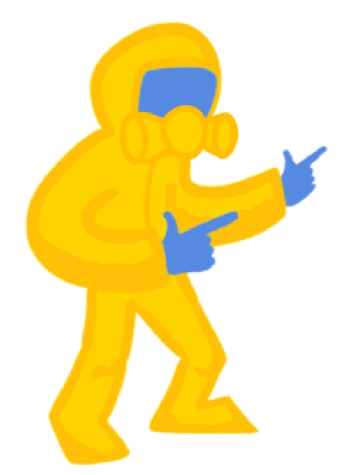

# 🟡 Hazmat Digger

A Dig Dug-inspired browser arcade game. Pure HTML/CSS/JavaScript, no build step, no dependencies.

**[▶ Play it live](https://YOUR-USERNAME.github.io/hazmat-digger/)** _(replace with your URL after deploying)_



## Controls

| Action | Keyboard | Controller |
|--------|----------|------------|
| Move / Dig | Arrow Keys or WASD | D-pad / Left Stick |
| Pump | Space (hold) | A / B / X / Right Trigger |
| Pause | P | Start / Options |

Pump enemies 3 times to pop them. Lure them under rocks for big points.

## Run locally

It's a static site — no build, no server needed for offline use.

```bash
git clone https://github.com/YOUR-USERNAME/hazmat-digger.git
cd hazmat-digger
```

Then either:
- **Open `index.html` directly** in your browser, or
- **Serve it locally** (recommended, so the sprite loads cleanly without `file://` quirks):
  ```bash
  python3 -m http.server 8000
  # then visit http://localhost:8000
  ```

## Deploy to GitHub Pages

1. **Create the repo on GitHub.** Make a new public repository (e.g., `hazmat-digger`).

2. **Push these files to it.**
   ```bash
   git init
   git add .
   git commit -m "Initial commit"
   git branch -M main
   git remote add origin https://github.com/YOUR-USERNAME/hazmat-digger.git
   git push -u origin main
   ```

3. **Enable Pages.** In your repo on GitHub:
   - Go to **Settings → Pages**
   - Under **Source**, choose **Deploy from a branch**
   - Set branch to **`main`** and folder to **`/ (root)`**
   - Click **Save**

4. **Wait ~1 minute.** Your game will be live at:
   ```
   https://YOUR-USERNAME.github.io/hazmat-digger/
   ```

That's it. Every push to `main` redeploys automatically.

## Project structure

```
hazmat-digger/
├── index.html        # The whole game (HTML + CSS + JS in one file)
├── assets/
│   └── player.png    # Player sprite — swap this to change the character
├── .nojekyll         # Tells GitHub Pages not to run Jekyll
├── .gitignore
├── LICENSE
└── README.md
```

## Swap the character

The easy way: replace `assets/player.png` with your own image of the same name. PNG with a transparent background works best.

The flexible way: edit one line in `index.html`. Search for:

```js
const PLAYER_SPRITE_SRC = 'assets/player.png';
```

and point it anywhere — a different filename, a subfolder, or a remote URL.

If your replacement image has a solid background you want made transparent, pre-process it once (any image editor's "remove background" tool works, or ImageMagick: `convert input.jpg -transparent white player.png`).

## Swap other assets

The enemies and rocks are drawn procedurally with canvas primitives, so they have no external files. To replace them with sprite images:

1. Drop your sprite files into `assets/` (e.g., `pooka.png`, `fygar.png`, `rock.png`).
2. In `index.html`, load them next to the player:
   ```js
   const pookaImg = new Image(); pookaImg.src = 'assets/pooka.png';
   const fygarImg = new Image(); fygarImg.src = 'assets/fygar.png';
   ```
3. In the `drawEnemy()` function, replace the procedural drawing with:
   ```js
   const img = e.type === 'fygar' ? fygarImg : pookaImg;
   ctx.drawImage(img, sx, sy, sw, sh);
   ```
4. Same idea for `drawRock()`.

## Tech notes

- Single-file game, ~1000 lines of well-commented JS
- HTML5 Canvas 2D rendering at 640×560
- Gamepad API for controller support (Standard Gamepad mapping)
- High score saved to `localStorage`
- No external libraries

## License

MIT — see [LICENSE](LICENSE).
